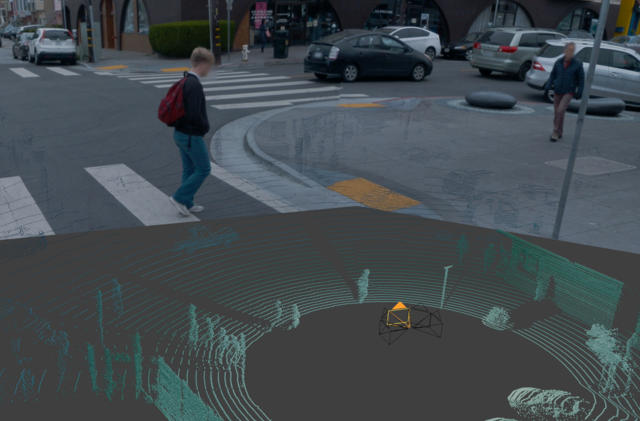
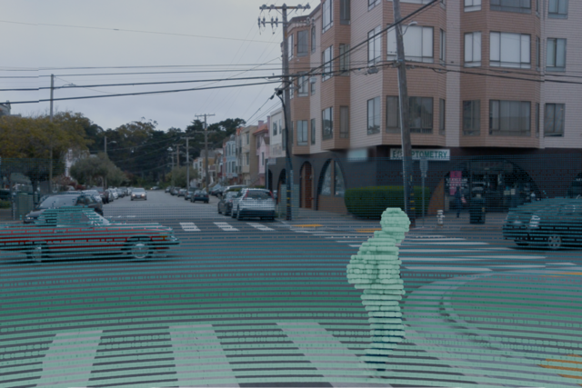

# Renderable Pointcloud Generator for 3D Perception and Blender

## Overview

<div style="display: flex; justify-content: space-between;">
   
   
</div>

This repository provides scripting tools to generate blender files in order to render point clouds from the Waymo 3D object detection benchmark. The tool utilizes a Blender file as a template to create an adjustable Blender project setup.
It utilizes the LiDAR camera calibration to place the LiDAR point clouds as well as RGB cameras with the respective image planes. The resulting file allows for individual customization of the rendering setup. 

## Work in Progress

This project is a work in progress. Contributions and suggestions are welcome. Please refer to the following section for current tasks and improvements.

## Features/TODOs

- [x] Generate Blender including renderable point cloud and image planes 
- [x] Preprocessing support for Waymo Open Dataset.
- [ ] Generalization and preprocessing support for nuScenes
- [ ] Generalization and preprocessing support for nuScenes
- [x] Perspective camera model
- [ ] Modelling Radial/Tangential Distortion
- [ ] Modelling Camera Motion
- [ ] Embed object class labels, bounding boxes, and confidence scores into the visualization
- [ ] Better configurable setup, e.g. using hydra 

## Requirements

- Python 3.11
- Blender (`bpy 4.3`)

## Getting Started

1. Clone the repository:
   ```bash
   git clone git@github.com:gfkri/bpy_pcv.git
   cd bpy_pcv

2. Install the required Python packages:
    ```bash
    pip install -r requirements.txt
    ```

3. Configure and run:
   ```bash
   python bpy_pc_visualization.py
   ```

4. Open the generated Blender file `output/output_file.blend`

5. Customize the rendering setup as needed and enjoy the result


